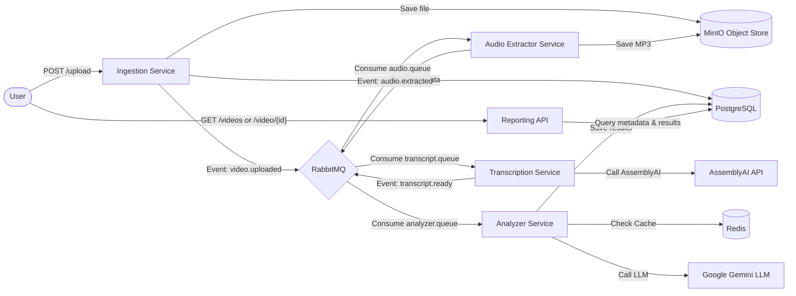

# Therapy Insight Engine

A distributed, event-driven microservices architecture for automated analysis of therapy session videos. This system ingests video files, extracts audio, performs speaker diarization, and uses GenAI (Gemini 2.5) to generate clinical insights and sentiment trends.

## Table of Contents
* [Features](#features)
* [System Architecture](#system-architecture)
* [Project Structure](#project-structure)
* [Prerequisites](#prerequisites)
* [Configuration](#configuration)
* [Installation](#installation)
* [Running the System](#running-the-system)
* [Usage](#usage)
* [Testing](#testing)
* [Technologies Used](#technologies-used)
* [Acknowledgments](#acknowledgments)

## Features

The system operates as a fully decoupled pipeline with the following capabilities:

### 1. Multi-Modal Ingestion
* **Resilient Uploads**: Accepts video files via a RESTful API and streams them securely to S3-compatible storage (MinIO).
* **State Persistence**: Immediately persists processing metadata to PostgreSQL to prevent race conditions and ensure data integrity.

### 2. Audio Intelligence
* **Extraction Pipeline**: Automatically strips audio tracks from video files using FFmpeg via asynchronous workers.
* **Speaker Diarization**: Uses AssemblyAI to transcribe text while accurately distinguishing between "Therapist" and "Patient" speakers.

### 3. Clinical AI Analysis
* **Cognitive Distortion Tracker**: Analyzes patient speech patterns to identify CBT distortions (e.g., Catastrophizing, Mind Reading, All-or-Nothing Thinking).
* **Therapist Intervention Analyzer**: Classifies therapeutic techniques used during the session (e.g., Validation, Open Question, Reflection).
* **Smart Caching**: Implements Redis caching to prevent redundant LLM calls for identical transcripts, saving costs and latency.
* **Structured Output**: Uses strict Pydantic validation to force the LLM (Gemini) to return consistent, queryable JSON data.

### 4. Enterprise Observability
* **Centralized Logging**: All services output structured JSON logs collected by Datadog.
* **Traceability**: Full visibility into the event lifecycle from video.uploaded to analysis_complete.

## System Architecture

The system uses a Choreography pattern where services react to events via RabbitMQ.




## Project Structure

```text
Therapy-Insight-Engine/
├── .env                        # Environment Configuration (API Keys)
├── .gitignore                  # Git ignore rules
├── docker-compose.yml          # Container Orchestration
├── init.sql                    # Database Schema Definition
├── pytest.ini                  # Pytest Configuration (Import Mode)
├── requirements.txt            # Python Dependencies
├── common/                     # Shared Library
│   ├── events.py               # Pydantic Event Models
│   └── logger.py               # Structured Logging Configuration
└── services/                   # Microservices
    ├── ingestion/              # Service 1: File Upload & Metadata
    ├── audio_extractor/        # Service 2: FFmpeg Processing
    ├── transcription/          # Service 3: AssemblyAI Worker
    ├── analyzer/               # Service 4: Gemini LLM Worker
    └── reporting/              # Service 5: Read-Only API
```
## Prerequisites

* Docker & Docker Compose
* Python 3.11+ (for local testing)
* API Keys:
    * Google Gemini API
    * AssemblyAI API
    * Datadog API (Optional, for logging)

## Configuration

1.  Create a `.env` file in the root directory.
2.  Populate it with your credentials:

```env
# --- Infrastructure (Local Defaults) ---
# MinIO (Object Storage)
MINIO_ROOT_USER=admin
MINIO_ROOT_PASSWORD=password123
MINIO_HOST=minio
MINIO_PORT=9000

# PostgreSQL (Database)
POSTGRES_USER=therapy_user
POSTGRES_PASSWORD=therapy_password
POSTGRES_DB=therapy_db
POSTGRES_HOST=postgres
POSTGRES_PORT=5432

# Redis (Caching & Pub/Sub)
REDIS_HOST=redis
REDIS_PORT=6379
REDIS_DB=0

# RabbitMQ (Message Broker)
RABBITMQ_USER=guest
RABBITMQ_PASSWORD=guest
RABBITMQ_HOST=rabbitmq
RABBITMQ_PORT=5672
RABBITMQ_VHOST=/

# --- Application Settings ---
# LLM Configuration
LLM=gemini-2.5-flash

# Service Metadata
SERVICE_NAME=therapy-insight-engine
ENVIRONMENT=development
LOG_LEVEL=INFO

# Datadog Site
DD_SITE=datadoghq.com

# --- Secrets (REQUIRED) ---
# Google AI Studio (Gemini)
GOOGLE_API_KEY=your_google_api_key_here

# AssemblyAI (Transcription)
ASSEMBLYAI_API_KEY=your_assemblyai_api_key_here

# Datadog Agent
DD_API_KEY=your_datadog_api_key_here
```
## Installation

### Prerequisites
* **Docker** & **Docker Compose** (for running infrastructure services)
* **Python 3.10+**
* **DataDog** (Optional, for logging)

### Setup Steps

1.  **Clone the repository**
    ```bash
    git clone <https://github.com/ohadbamram/Therapy-Insight-Engine>
    cd therapy-insight-engine
    ```

2.  **Set up the Virtual Environment**
    Always run Python within a virtual environment to isolate dependencies.
    ```bash
    python -m venv .venv
    source .venv/bin/activate  # On Windows use: .venv\Scripts\activate
    ```

3.  **Install Dependencies**
    Ensure your virtual environment is active before running this command.
    ```bash
    pip install -r requirements.txt
    ```


## Running the System

Start **all infrastructure and microservices** with:

```bash
docker compose --profile services up -d --build
```

### Default Local Access

| Component | URL |
|----------|-----|
| Video Upload API (Ingestion) | http://localhost:8000/docs |
| Reporting API | http://localhost:8001/docs |
| MinIO Console | http://localhost:9001 |
| RabbitMQ Dashboard | http://localhost:15672 |
| PostgreSQL | http://localhost:5432 |
| Redis | http://localhost:6379 |

---

## Usage

### Uploading a Video (FastAPI GUI)

To upload a video, open the ingestion API GUI in your browser:

http://localhost:8000/docs

Use the `POST /upload` endpoint.

Once submitted, you will be redirected inside the GUI to review the request and response.

---

### Viewing Centralized Logs (Datadog)

All services are configured to output structured JSON logs collected and forwarded to Datadog (if you provided the `DD_API_KEY`).

To view logs for the entire system:

1.  Navigate to your **Datadog Log Explorer**.
2.  Filter the logs using the service name:
    ```text
    service:therapy-insight-engine* 
    ```

---

### Viewing Processed Videos

To review processed sessions, open the reporting API GUI:

http://localhost:8001/docs

Available endpoints:

| Description | Endpoint |
|------------|----------|
| List all processed sessions | `GET /videos` |
| Retrieve full analysis for one session | `GET /video/{video_id}` |

---

### Curl Examples

Upload a video:

```bash
curl -X POST http://localhost:8000/upload \
  -H "Content-Type: multipart/form-data" \
  -F "file=@session.mp4"
```

List all processed sessions:

```bash
curl http://localhost:8001/videos
```

Fetch detailed JSON insights:

```bash
curl http://localhost:8001/video/<video_id>
```

Replace <video_id> with the ID returned in the list of videos.


## Testing

Each microservice includes isolated unit tests stored under:

```bash
services/<service-name>/tests/
```

Run all tests:

```bash
pytest -q
```


## Technologies Used

| Technology | Purpose |
|------------|--------|
| FastAPI | REST API microservices |
| FastStream | Event driven pipeline |
| RabbitMQ | Message broker |
| PostgreSQL | Metadata and analysis result storage |
| MinIO | S3 compatible video and audio storage |
| FFmpeg | Audio extraction from video |
| Redis | Caching and LLM deduplication |
| Google Gemini 2.5 Flash | Conversation insights and JSON structured analysis |
| AssemblyAI | Transcription and speaker diarization |
| Pydantic and Pydantic Settings | Typed models, input validation, config |
| Structlog | Structured JSON logs |
| Docker and Docker Compose | Infrastructure and service orchestration |
| Pytest, pytest asyncio, httpx, pytest mock | Testing framework and tooling |
---

## Acknowledgments

This tool was developed as part of the Advanced Systems Development Using AI course at Reichman University, led by David (Dudu) Kalmanson. Special thanks for the valuable resources and guidance provided.
